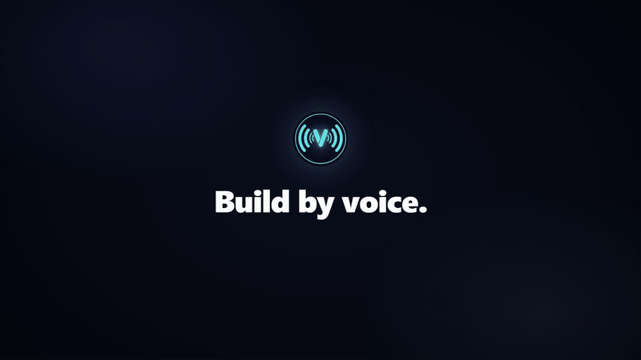

# Voice Mirror

<p align="center">
  
</p>

<p align="center">
  <strong>A voice-native IDE — build real apps and websites by voice, watch them render live, and let the in-app AI see and drive the running app.</strong><br>
  <sub>Built with Tauri 2, Rust, and Svelte 5.</sub>
</p>

<p align="center">
  <a href="https://www.contextmirror.com">Website</a> •
  <a href="https://discord.com/invite/JBpsSFB7EQ">Discord</a> •
  <a href="#features">Features</a> •
  <a href="#quick-start">Quick Start</a> •
  <a href="#ai-providers">Providers</a> •
  <a href="CHANGELOG.md">Changelog</a> •
  <a href="docs/README.md">Docs</a> •
  <a href="#license">License</a>
</p>

<p align="center">
  
  
  
  
  <a href="https://discord.com/invite/JBpsSFB7EQ"></a>
</p>

> **Alpha — Windows-first launch.** Voice Mirror is in active development. The full voice → build → see → fix loop (live App Preview, native-app driving, push-to-talk) is **Windows-only** for v1. The macOS/Linux builds run the chat, terminal, and editor, but not yet the live-preview loop. Bug reports and feedback welcome via [GitHub Issues](https://github.com/contextmirror/voice-mirror/issues) or [Discord](https://discord.com/invite/JBpsSFB7EQ).

<p align="center">
  <a href="https://contextmirror.com/">
    
  </a>
  <br/>
  <sub>▶ <a href="https://contextmirror.com/">Watch the full one-minute promo (with sound) on contextmirror.com</a></sub>
</p>

---

## What is Voice Mirror?

Voice Mirror is a **voice-native IDE**. You describe what you want to build out loud, an AI coding agent writes the code, and you **watch the app render live** in an in-app App Preview — the same surface the AI itself can see and drive. The north star is the **voice → build → see → fix loop**: speak, build, watch it render, point at what's wrong, fix it.

It is one desktop app that combines:

- a **Lens workspace** — CodeMirror editor with LSP, file tree, integrated terminal, and dev-server management;
- a **live App Preview** — your running web app, Tauri/Electron app, or native window mirrored inside Voice Mirror;
- an **AI that can see and drive the preview** — CDP for web/Tauri/Electron, UI Automation for native apps, the same view you're watching;
- a **Rust-native voice pipeline** — speech-to-text, text-to-speech, and voice activity detection running directly in the app.

---

## Features

### Lens workspace
A full IDE surface inside Voice Mirror: **CodeMirror 6** editor with multi-language syntax highlighting, **LSP** (diagnostics, outline, references, rename, code actions), a file tree with inline diagnostics, **split editors**, a **Command Palette**, an integrated **terminal**, **Git** changes view, and **dev-server management** that detects framework + port and captures build/console logs.

### Live App Preview *(Windows v1)*
Build an app and watch it render live, mirrored inside Voice Mirror. The preview tracks whatever you **or** the AI most recently touched, follows window focus, and cleans up when the app closes. The in-app AI drives the **same** surface you watch — click, type, navigate, screenshot — via CDP (web / Tauri / Electron) or UI Automation (native Windows apps).

### Voice interaction *(push-to-talk Windows v1)*

| Mode | Use case |
|------|----------|
| **Push to talk** | Hold to speak, release to send |
| **Dictation** | Voice-to-text into the focused input |
| **Toggle / continuous** | Hands-free conversational loop |

The voice pipeline is fully **Rust-native** — Whisper for speech-to-text (with optional **CUDA** GPU acceleration), Kokoro and Edge TTS for synthesis, and VAD for turn detection. No child processes or external binaries.

### Screen + app awareness
The AI can capture your screen or the previewed app window and reason about what it sees — analyze an error, inspect rendered UI, or verify a change actually worked.

### Built-in MCP server
`voice-mirror-mcp` is a compiled **Rust binary** (stdio JSON-RPC) that exposes Voice Mirror's capabilities — voice I/O, screen/app capture, app driving (the sandbox preview), persistent memory, browser automation, and n8n workflow control — to the AI agent. Tool groups load on demand.

### Get Started tutorial
A guided **Get Started** walkthrough (Help → Get Started), a wired title-bar menu, and the Command Palette help new users find their way around on first run.

---

## AI Providers

Pick a brain by **right-clicking the Voice Agent tab**. Voice Mirror supports:

| Provider | Type | Notes |
|----------|------|-------|
| **Claude Code** | CLI agent | Anthropic's CLI — MCP tools, vision, full terminal, `CLAUDE.md` ecosystem |
| **OpenCode** | CLI agent | Universal gateway to many models (GPT, Gemini, Kimi, and more) with MCP support |
| **Codex / Gemini CLI / Kimi CLI** | CLI agent | Additional first-party CLI agents |
| **Ollama / LM Studio / Jan** | Local LLM | Auto-detected local servers; run models on your own hardware (vision supported) |
| **OpenAI / Groq** | Cloud API | Hosted models via API key |
| **Dictation** | Voice-to-text | No LLM — straight speech-to-text into the focused input |

CLI agents run as real PTY-backed processes inside the app with full MCP tool access. Local servers are auto-detected.

---

## Quick Start

### Download

Grab the latest installer from [**GitHub Releases**](https://github.com/contextmirror/voice-mirror/releases). Voice Mirror is **Windows-first** for v1 — the full live-preview loop targets Windows 10/11.

| Platform | Status |
|----------|--------|
| **Windows 10/11** | Primary — full voice → build → see → fix loop |
| **macOS / Linux** | Experimental — chat, terminal, and editor run; live App Preview / native driving / push-to-talk not yet available |

Everything is bundled — no Node.js, Rust, or build tools required to run the installer.

### Run from source

```bash
git clone https://github.com/contextmirror/voice-mirror.git
cd voice-mirror

npm install        # JS dependencies (frontend + test tooling)
npm run dev        # builds the voice-mirror-mcp binary, then launches `tauri dev`
```

`npm run dev` first compiles the native `voice-mirror-mcp` binary, then starts the Tauri app with Vite HMR. The frontend dev server runs on **port 31420** (moved off the default Tauri port so previewed apps never collide).

**Dev requirements:** Node.js 22+, the Rust toolchain (via [rustup](https://rustup.rs/)), the Tauri 2 prerequisites for your OS, plus LLVM/libclang and CMake (for the native ML stack). Optional: **CUDA** for GPU-accelerated Whisper.

### Build a release

```bash
npm run build      # builds the release voice-mirror-mcp binary, then `tauri build`
```

### Verify

```bash
npx vite build                                # frontend compiles
cargo check --manifest-path src-tauri/Cargo.toml   # Rust backend compiles
cargo build --bin voice-mirror-mcp --manifest-path src-tauri/Cargo.toml  # MCP binary
npm test                                      # JS tests (node:test, source-inspection)
```

> Note: `cargo test --lib` currently fails on Windows due to a WebView2 DLL load — use `cargo check --tests` to verify compilation. The MCP binary tests (`cargo test --bin voice-mirror-mcp`) do run.

### Optional dependencies

- **Claude Code CLI** or **OpenCode** (for those providers) — or any of the other CLI agents
- **Ollama / LM Studio / Jan** running locally (auto-detected)
- **CUDA** toolkit for GPU-accelerated speech-to-text

---

## Configuration

Data and config live under a single per-user directory:

| Platform | Path |
|----------|------|
| Windows | `%APPDATA%\voice-mirror\` |
| macOS | `~/Library/Application Support/voice-mirror/` |
| Linux | `~/.config/voice-mirror/` |

Models, memory, logs, and `config.json` all live there. Settings are editable from the in-app Settings page — AI provider, voice engine, activation mode, audio devices, appearance, and more.

Crashes and hangs self-report to `%APPDATA%\voice-mirror\logs\crashes.log`, and a runtime self-diagnostic system surfaces broken subsystems in-app.

---

## Project Structure

```
voice-mirror/
├── src-tauri/              # Rust backend (Tauri 2)
│   ├── src/
│   │   ├── commands/       # Tauri commands (config, window, voice, lens, lsp, screenshot, …)
│   │   ├── providers/      # AI providers (CLI via PTY + HTTP API + dictation)
│   │   ├── voice/          # Voice pipeline (Whisper STT, Kokoro/Edge TTS, VAD)
│   │   ├── mcp/            # Built-in MCP server + handlers (also built as voice-mirror-mcp)
│   │   ├── services/       # Platform services (sandbox preview, window follow, output/logs)
│   │   ├── ipc/            # Named-pipe IPC between the MCP binary and the app
│   │   └── bin/mcp.rs      # voice-mirror-mcp binary entry point
│   ├── Cargo.toml
│   └── tauri.conf.json
├── src/                    # Svelte 5 frontend
│   ├── components/         # chat, lens (editor/preview/terminal), settings, shared, overlay
│   ├── lib/
│   │   ├── api.js          # Tauri invoke() wrappers
│   │   └── stores/         # Reactive runes-based stores (.svelte.js)
│   └── styles/
├── test/                   # JS tests (node:test, source-inspection)
├── docs/                   # Documentation (see docs/README.md)
├── scripts/ · tools/       # Build + dev tooling
└── CHANGELOG.md
```

---

## Documentation

- **[docs/README.md](docs/README.md)** — documentation index and suggested reading order
- **[docs/guides/GETTING-STARTED.md](docs/guides/GETTING-STARTED.md)** — dev setup, project structure, commands
- **[docs/source-of-truth/ARCHITECTURE.md](docs/source-of-truth/ARCHITECTURE.md)** — system overview
- **[docs/guides/VOICE-PIPELINE.md](docs/guides/VOICE-PIPELINE.md)** — the Rust-native STT/TTS/VAD pipeline
- **[CONTRIBUTING.md](CONTRIBUTING.md)** — how to build, test, and contribute

---

## Security & Trust

- **Tauri security model** — no Node.js in the WebView; all backend logic is Rust behind type-checked `#[tauri::command]` handlers and Tauri 2's capability permissions.
- **Tool-mediated actions** — every browser/app action flows `LLM → tool schema → controller`. Actions are enumerable, reviewable, and loggable.
- **Explicit capture** — screenshots are triggered by tool calls or user request, not captured passively.
- **MCP tool gating** — tool groups load on demand; the AI can only use what's loaded for the session.

See [SECURITY.md](SECURITY.md) for the disclosure policy and the full security model.

---

## License

[MIT](LICENSE)

---

<p align="center">
  <sub>Built with Tauri, Rust, Svelte — and a lot of voice commands.</sub>
</p>
